# Mas-Lib Doc
## Introduction
**mas-lib** is a math library for graphics dev, which provides basic types `vector`, `matrix` and *Model*, *View*, *Projection* (aka *MVP*) transformations.

## Usage
**mas-lib** is a header-only library, you add `mas_project_dir/include` into your project's include directory. Here is an example.

**CMakeLists.txt**
```cmake
cmake_minimum_required(VERSION 3.22)
project("mas-lib-test")

set (CMAKE_CXX_STANDARD 17)

add_executable("Mas-Lib-Test" main.cpp)

target_include_directories(
    "mas-lib-test" PUBLIC
    include/
)
```

**main.cpp**
```cpp
#define MAS_PTYPE_FLOAT
#include "mas/mas.hpp"

int main() {
    mas::vec4 pos(1.0f);
    mas::mat4 model(1.0f);

    model = mas::translate(model, mas::vec3(1.0f, 0.0f, 0.0f));
    mas::vec4 final_pos = model * pos;

    return 0;
}
```

## Project Overview
```
|include  # headers include dir
|--> |mas
     |--> mas.hpp  # mas-lib entry header
     |
     |--> |types
     |    |--> |vector
     |    |--> |matrix
     |    |--> shared_common.hpp
     |
     |--> |utils
          |--> common.hpp
          |--> constants.hpp
          |--> angle.hpp
          |--> transform.hpp
          |--> lookat.hpp
          |--> projection.hpp
```

## Documents
Notice: All types and function are included in the namespace `mas`.

### Types
#### provided types
**mas-lib** provides `vector` and `matrix` types.

**Vector**
- vector2 <T\> (x, y)
- vector3 <T\> (x, y, z)
- vector4 <T\> (x, y, z, w)

**Matrix**
- matrix2 <T\> (2x2)
- matrix3 <T\> (3x3)
- matrix4 <T\> (4x4)

What's more, **mas-lib** provide `pre-types` for you to use these basic types more easily. Using `pre-types` to avoid unnecessary types conversion.

You can enable `pre-types` by defining `MAS_PTYPE_` macro, **mas-lib** offers three `pre-types`.
```cpp
#define MAS_PTYPE_INT // T = int | e.g. vec3 = Vector3<int>
#define MAS_PTYPE_FLOAT // T = float
#define MAS_PTYPE_DOUBLE // T = double
```

Now, you can use `vector` and `matrix` more easily:

- vec2 = Vector2
- vec3 = Vector3
- vec4 = Vector4
- mat2 = Matrix2
- mat3 = Matrix3
- mat4 = Matrix4

#### supported operators
**Vector**
```ts
NOTICE: vec = vector , num = number

vec = vec + vec
vec = vec - vec
vec = vec * vec
vec = vec / vec

vec = vec + num
vec = vec - num
vec = vec * num
vec = vec / num

vec = cross(vec, vec)
num = dot(vec, vec)
```

**Matrix**
```ts
NOTICE: mat = matrix, vec = vector, num = number

mat = mat + mat
mat = mat - mat
mat = mat * mat

mat = mat + num
mat = mat - num
mat = mat * num
mat = mat / num

vec = mat * vec
```

### Utils
TODO

## Memory Layout
### Vector Types

**definition**

```cpp
auto v = mas::Vector4<int>(1, 2, 3, 4);
```

$$
\bar{v} = \begin{pmatrix} 1 \\ 2 \\ 3 \\ 4 \end{pmatrix}
$$

**memory layout**




### Matrix Types

**matrix**

All matrix types in **mas-lib** are stored in memory in *column-major order*.

**definition**
```cpp
auto m = mas::mat3<int> {
    1, 2, 3,
    4, 5, 6,
    7, 8, 9
};
```

$$
M = \begin{bmatrix} 1 & 2 & 3 \\ 4 & 5 & 6 \\ 7 & 8 & 9 \end{bmatrix}\quad

$$

**memory layout**

