# Mas-Lib Doc
## Introduction
`mas-lib` is a lightweight, header only C++ linear math library for graphics development, which provides basic types and utility functions for CG development.

## Usage
**mas-lib** is a header-only library. To use it in your project, you should clone this project and then add `mas-project/include` directory's path into your project's include directory. The following example shows how to use `mas` in a **CMake** project.

**CMakeLists.txt**
```cmake
cmake_minimum_required(VERSION 3.22)
project("mas-test")

add_executable("mas-test" main.cpp)

target_include_directories(
    "mas-test" PUBLIC
    include/
)
```

**main.cpp**
```cpp
#define MAS_PTYPE_FLOAT
#include "mas/mas.hpp"

int main() {
    mas::vec4 pos(1.0f);
    mas::mat4 model(1.0f);

    model = mas::translate(model, mas::vec3(1.0f, 0.0f, 0.0f));
    mas::vec4 final_pos = model * pos;

    return 0;
}
```

## Project Overview
```
|include  # headers include dir
|--> |mas
     |--> mas.hpp  # mas-lib shared header
     |
     |--> |types  # mas-lib types defination
     |    |--> |vector
     |    |--> |matrix
     |    |--> shared_common.hpp
     |
     |--> |utils  # mas-lib utility defination
          |--> common.hpp
          |--> constants.hpp
          |--> angle.hpp
          |--> transform.hpp
          |--> lookat.hpp
          |--> projection.hpp
```

## Documents
**Notice: All types and functions are within the namespace `mas`.**

### Types
#### supported types
**mas-lib** provides two types: `vector` and `matrix`.

**Vector**
- *vector2 <T\> ( x, y )*
- *vector3 <T\> ( x, y, z )*
- *vector4 <T\> ( x, y, z, w )*

**Matrix**
- *matrix2 <T\> (2 x 2)*
- *matrix3 <T\> (3 x 3)*
- *matrix4 <T\> (4 x 4)*

#### pre-defined types
Besides, **mas-lib** provide `pre-defined types` for you to use these basic types more easily. **Using PTYPE to avoid unnecessary types conversion.**

**mas-lib** offers three kinds of `pre-defined types`, and you can enable them by defining `MAS_PTYPE_` macro before including `mas/mas.hpp`.
```cpp
#define MAS_PTYPE_INT // T = int | aka "using vec3 = Vector3<int>"
#define MAS_PTYPE_FLOAT // T = float
#define MAS_PTYPE_DOUBLE // T = double
```

Now, you can use them simply by using following name:

- **vec2 = Vector2**
- **vec3 = Vector3**
- **vec4 = Vector4**
- **mat2 = Matrix2**
- **mat3 = Matrix3**
- **mat4 = Matrix4**

#### spported operators
**Vector**
```ts
NOTICE: vec = vector , num = number

vec = vec + vec
vec = vec - vec
vec = vec * vec
vec = vec / vec

vec = vec + num
vec = vec - num
vec = vec * num
vec = vec / num

vec = cross(vec, vec)
num = dot(vec, vec)
```

**Matrix**
```ts
NOTICE: mat = matrix, vec = vector, num = number

mat = mat + mat
mat = mat - mat
mat = mat * mat

mat = mat + num
mat = mat - num
mat = mat * num
mat = mat / num

vec = mat * vec
```

### Utility
TODO

## Memory Layout
### Vector Types

**code format**

```cpp
auto v = mas::Vector4<int>(1, 2, 3, 4);
```

**math format**

$
\bar{v} = \begin{pmatrix} 1\\ 2\\ 3\\ 4 \end{pmatrix}
$

**memory layout**




### Matrix Types

**matrix**

All matrix types in **mas-lib** are stored in memory in *row-major order*. In some graphics APIs like OpenGL and Vulkan, which expect the input matrices to be laid out in column-major order, you need to use the function `mas::transpose` to transpose matrices before inputting them.

**code format**
```cpp
auto m = mas::mat3<int> {
    1, 2, 3,
    4, 5, 6,
    7, 8, 9
};
```

**math format**

$
M = \begin{bmatrix} 1 & 2 & 3\\ 4 & 5 & 6\\ 7 & 8 & 9 \end{bmatrix}\quad
$

**memory layout**

